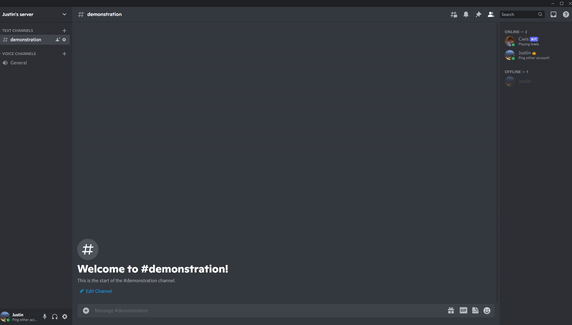
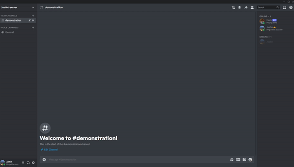
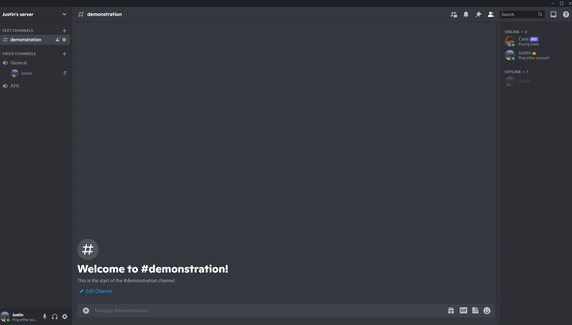
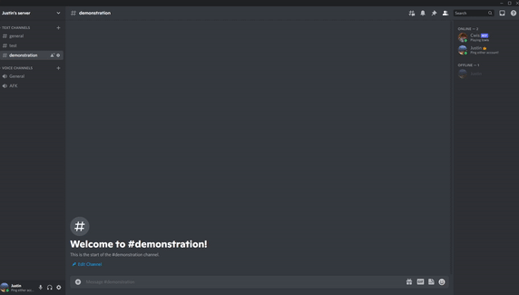

# Cwis
Cwis is a simple Discord bot coded in Java using [Discord JDA](https://github.com/DV8FromTheWorld/JDA).

### Why did I create this?
Discord is an application that my friends and I use to communicate to each other online. Throughout our times together, one of my friends suggested that our server should have a bot that is personal to us. He wanted a bot that would respond to us with silly messages that only our friend group would understand. I decided to create the bot, and in doing so, I learned a lot about what Discord JDA can do.

## Features
### Commands
#### The bot can:
- automatically reply to members (it does not have to be a command)
- display how many hours, minutes and seconds are left until it reaches a certain time
- generate a random number for a member

### YouTube Data API
When sharing a YouTube video the server, the bot can use the YouTube Data API to gather resources (title, description, tags, etc.) and send a message. For example, in the GIF below, the bot immediately sends a message when the user shares a Honda-related video.

### Notify Members
While group DMs are more limited than servers, one thing that group DMs can do that servers cannot do is notify others when a member starts a call. However, if the bot is in your server, members can be pinged when at least two users are in a voice channel. This feature can be adjusted or turned off.

### Announcements
The bot can make announcements at any given time.

